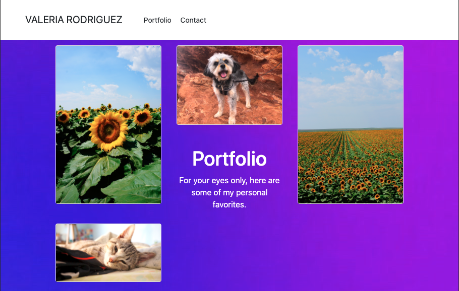

# hw02-responsivePortfolio
A responsive webpage is important to the user of the web application for the reason that it creates a friendly experience for a variety of screen sizes, from phone, iPad, to desktop. The flexibility of the website's layout allows for the user to gain access on most, if not all platforms of their choosing. 

My motivation for this project was to learn how to implement the tools utilized to create a responsive webpage. In addition to getting aquainted with the source known as Bootstrap. I was the most excited to finally have the buttons function, but even above that the opportunity to build my own website, where any user or future employer could get to know me and my projects. 

## What A Process!
Bootstrap was a prominent source in the developement for this job. It helped significantly with the layout of each webpage. How I chose to add a touch of my personality to the visual aspects of the pages was to add a gradient background. My objective was to have a colorful but clean display for whatever screen it is to be viewed through. 

### ✨ On HTML
I commenced with the AboutMe page, found under the index.html file, where I created the layout and chose the theme for the website. Next was the portfolio page (portfolio.html), where I had fun challenging the traditional sequential layout, adding my own spin to the placement of the header of the page and its summary, by slapping it in the middle. Then I continued on to the contact page (contact.html), fiddled with the layout there and chose a similar but different gradient so it stood out from the rest of the pages. From there on, I placed some visual touches in their CSS files.

### ✨ On CSS
Though not much CSS was developed, my utility for it was to finess and place final touches for each of the pages. I made the choice to have the index file and portfolio file share the same CSS file (index.css) for the reason that they shared the same background gradient color. The contact HTML file had its own CSS file (contact.css) for the purpose of its different background and header. Once I completed the finishing styling touches, I moved on to the button functionality.

### ✨ Buttons
One of the greater challenges I had was figuring out how to program a functional button that could guide its user to the button's linked page. The amount of docs that were tried and untrue was rough. Through persistence though, I finally found a source that provided assistance in the department of functioning buttons. From there on out, all three pages have buttons that do the job nicely and complete the overall task.

## Take a L👀K!
### About Me:

### Portfolio:

### Contact:

*NOTE*: Images on additional display sizes can be found under the 'Assets' file.